# DotNetArchitecture

## Technologies:

* Visual Studio 2017
* NET Framework 4.7.1
* NET Core 2.0
* C# 7.2
* ASP.NET Core 2.0
* Angular 5.2.9
* Typescript 2.7.2
* HTML5
* CSS3
* SASS (Syntactically Awesome Style Sheets)
* Dependency Injection (Microsoft.Extensions.DependencyInjection)
* ORM - Object-Relational Mapping (Entity Framwork Core 2.0)
* JWT - Json Web Token (Microsoft.IdentityModel.Tokens)
* Memory Caching (Microsoft.Extensions.Caching.Memory)
* Response Caching (Microsoft.AspNetCore.ResponseCaching)
* Object Mapping (AgileMapper)
* Unit of Work Pattern
* Repository Pattern

## Continuous Integration Build Status:

## Layers:

## Application:

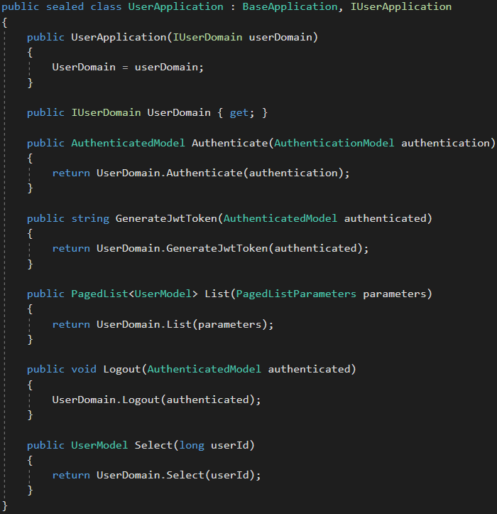

## Repository:

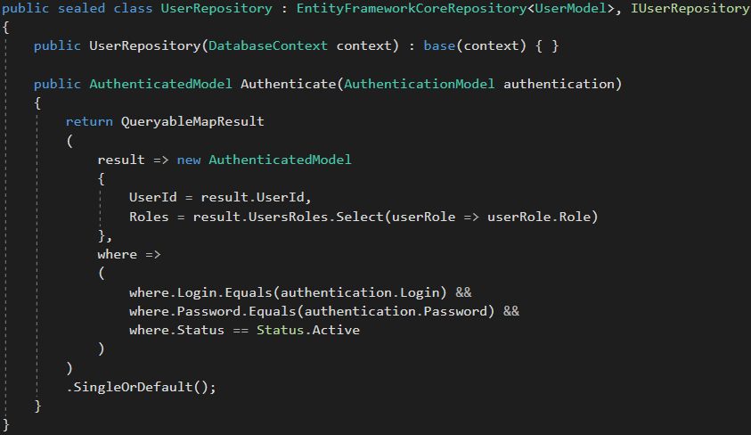

## Unit Test:

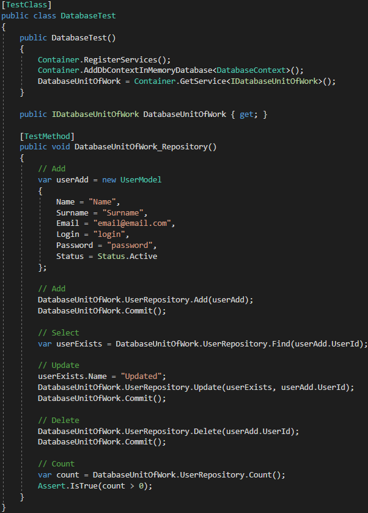

## ASP.NET Core + Angular:

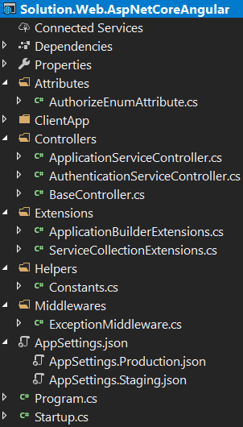

## ASP.NET Core Startup:

## ASP.NET Core Controller:

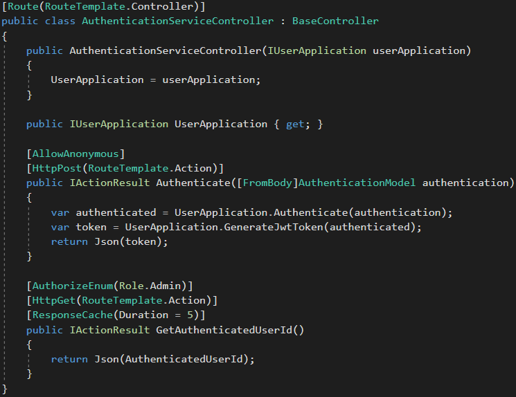

## Angular Guard:

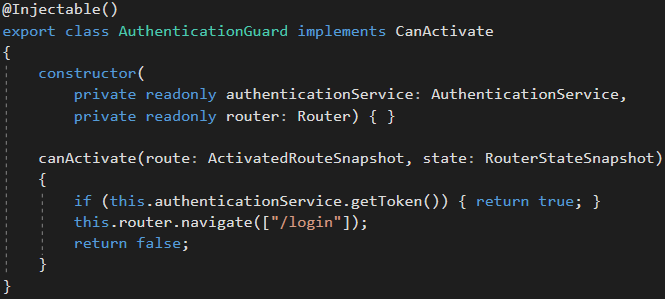

## Angular Error Handler:

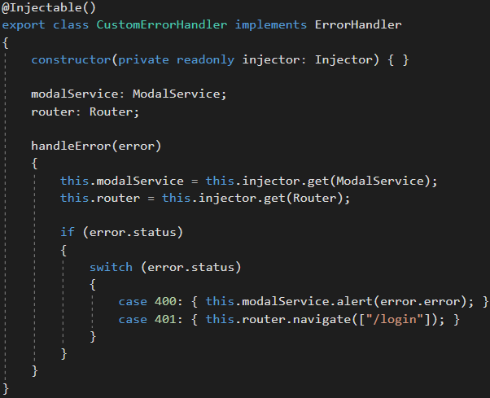

## Angular HTTP Interceptor:

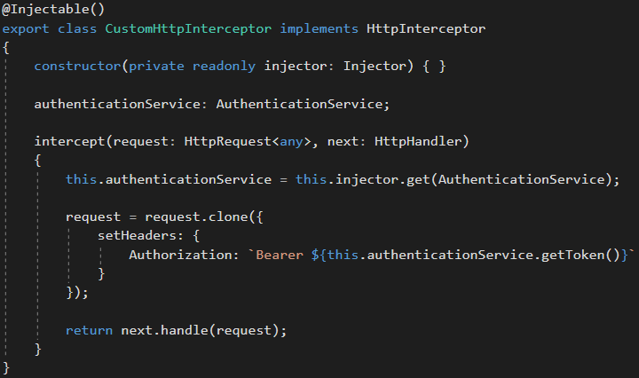

## Angular Service with Cache:

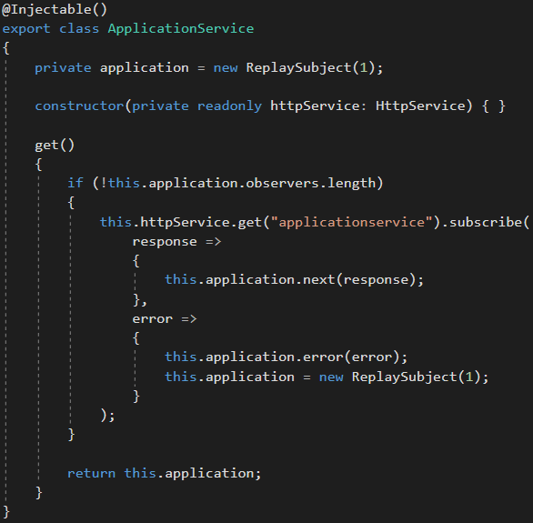

## Angular Login Component:

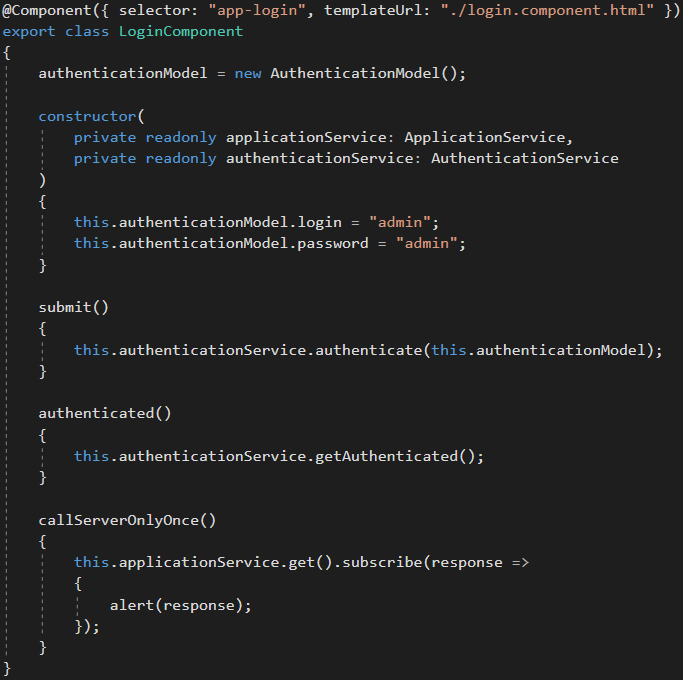

## ASP.NET Core + Angular Initial Loading:

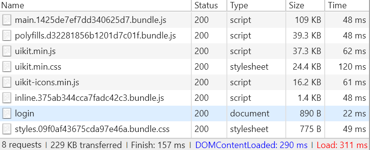

## ASP.NET Core + Entity Framework Core + SQL Server + Angular Performance:

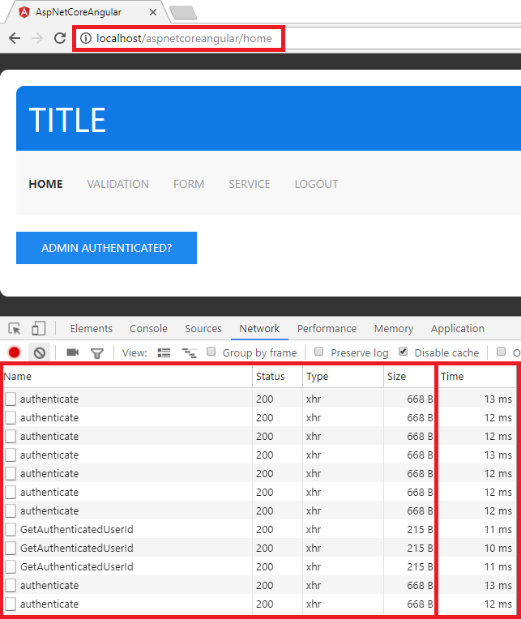

## Publish and Run in IIS:

1. Install **NET Core 2.0 Windows Hosting**: https://aka.ms/dotnetcore-2-windowshosting.

2. Change the **SQL Server Database Connection String** in the **AppSettings.json** files.

3. Change the **base-href** variable in the **scripts** section in the **ClientApp\package.json** file:
	- "production": "--base-href=/**IIS_APPLICATION_NAME**/"

4. Publish ASP.NET Core Project in the Visual Studio.

5. Copy the published files to **IIS Directory** (inetpub\wwwroot\\**IIS_APPLICATION_NAME**).

6. In the **IIS**, create an **Application Pool** with **.NET CLR Version** = **No Managed Code**.

7. In the **IIS**, **Convert to Application** and use the **Application Pool** created in the previous step.

8. Run and fun!